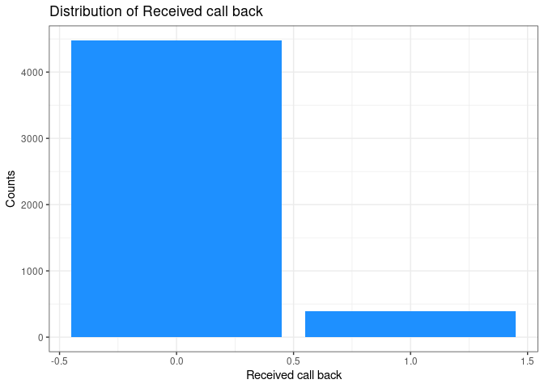
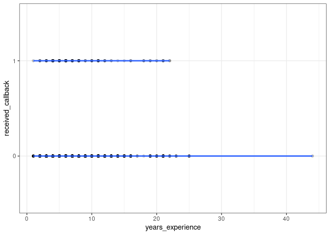
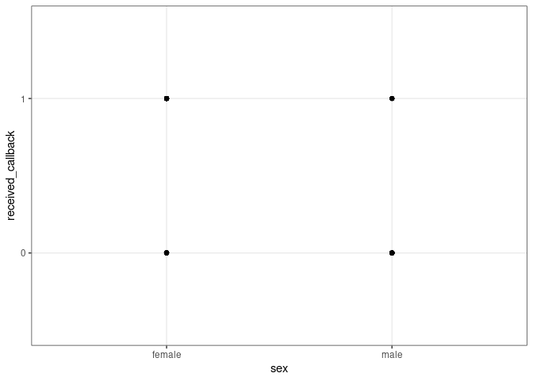
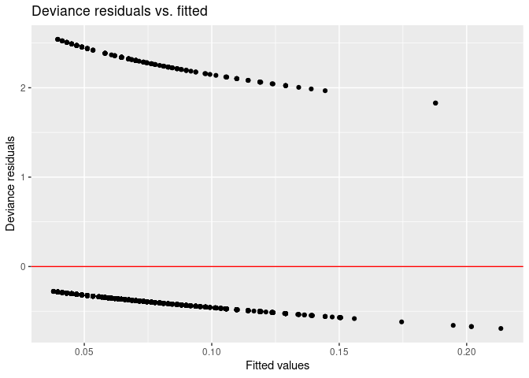
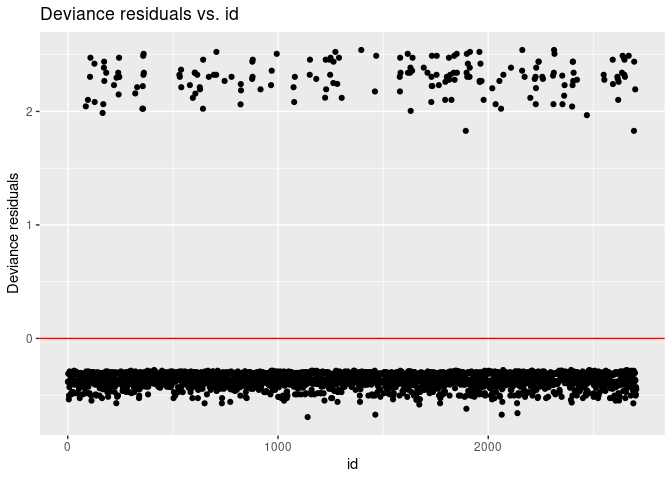

Activity 6 - Logistic Regression
================

## Task 2: Load the necessary packages

``` r
library(tidyverse)
```

    ## ── Attaching packages ─────────────────────────────────────── tidyverse 1.3.2 ──
    ## ✔ ggplot2 3.3.6     ✔ purrr   0.3.4
    ## ✔ tibble  3.1.8     ✔ dplyr   1.0.9
    ## ✔ tidyr   1.2.0     ✔ stringr 1.4.1
    ## ✔ readr   2.1.2     ✔ forcats 0.5.2
    ## ── Conflicts ────────────────────────────────────────── tidyverse_conflicts() ──
    ## ✖ dplyr::filter() masks stats::filter()
    ## ✖ dplyr::lag()    masks stats::lag()

``` r
library(tidymodels)
```

    ## ── Attaching packages ────────────────────────────────────── tidymodels 1.0.0 ──
    ## ✔ broom        1.0.0     ✔ rsample      1.1.0
    ## ✔ dials        1.0.0     ✔ tune         1.0.0
    ## ✔ infer        1.0.3     ✔ workflows    1.0.0
    ## ✔ modeldata    1.0.0     ✔ workflowsets 1.0.0
    ## ✔ parsnip      1.0.1     ✔ yardstick    1.0.0
    ## ✔ recipes      1.0.1     
    ## ── Conflicts ───────────────────────────────────────── tidymodels_conflicts() ──
    ## ✖ scales::discard() masks purrr::discard()
    ## ✖ dplyr::filter()   masks stats::filter()
    ## ✖ recipes::fixed()  masks stringr::fixed()
    ## ✖ dplyr::lag()      masks stats::lag()
    ## ✖ yardstick::spec() masks readr::spec()
    ## ✖ recipes::step()   masks stats::step()
    ## • Learn how to get started at https://www.tidymodels.org/start/

``` r
#library(dplyr)
library(skimr)
```

## Task 3: Load the data

``` r
resume <- data.frame(readr::read_csv("https://www.openintro.org/data/csv/resume.csv"))
```

    ## Rows: 4870 Columns: 30
    ## ── Column specification ────────────────────────────────────────────────────────
    ## Delimiter: ","
    ## chr (10): job_city, job_industry, job_type, job_ownership, job_req_min_exper...
    ## dbl (20): job_ad_id, job_fed_contractor, job_equal_opp_employer, job_req_any...
    ## 
    ## ℹ Use `spec()` to retrieve the full column specification for this data.
    ## ℹ Specify the column types or set `show_col_types = FALSE` to quiet this message.

``` r
glimpse(resume)
```

    ## Rows: 4,870
    ## Columns: 30
    ## $ job_ad_id              <dbl> 384, 384, 384, 384, 385, 386, 386, 385, 386, 38…
    ## $ job_city               <chr> "Chicago", "Chicago", "Chicago", "Chicago", "Ch…
    ## $ job_industry           <chr> "manufacturing", "manufacturing", "manufacturin…
    ## $ job_type               <chr> "supervisor", "supervisor", "supervisor", "supe…
    ## $ job_fed_contractor     <dbl> NA, NA, NA, NA, 0, 0, 0, 0, 0, 0, 0, 0, 0, 0, N…
    ## $ job_equal_opp_employer <dbl> 1, 1, 1, 1, 1, 1, 1, 1, 1, 1, 1, 1, 1, 1, 1, 1,…
    ## $ job_ownership          <chr> "unknown", "unknown", "unknown", "unknown", "no…
    ## $ job_req_any            <dbl> 1, 1, 1, 1, 1, 0, 0, 1, 0, 0, 1, 1, 1, 1, 0, 0,…
    ## $ job_req_communication  <dbl> 0, 0, 0, 0, 0, 0, 0, 0, 0, 0, 0, 0, 1, 1, 0, 0,…
    ## $ job_req_education      <dbl> 0, 0, 0, 0, 0, 0, 0, 0, 0, 0, 0, 0, 0, 0, 0, 0,…
    ## $ job_req_min_experience <chr> "5", "5", "5", "5", "some", NA, NA, "some", NA,…
    ## $ job_req_computer       <dbl> 1, 1, 1, 1, 1, 0, 0, 1, 0, 0, 1, 1, 1, 1, 0, 0,…
    ## $ job_req_organization   <dbl> 0, 0, 0, 0, 1, 0, 0, 1, 0, 0, 0, 0, 1, 1, 0, 0,…
    ## $ job_req_school         <chr> "none_listed", "none_listed", "none_listed", "n…
    ## $ received_callback      <dbl> 0, 0, 0, 0, 0, 0, 0, 0, 0, 0, 0, 0, 0, 0, 0, 0,…
    ## $ firstname              <chr> "Allison", "Kristen", "Lakisha", "Latonya", "Ca…
    ## $ race                   <chr> "white", "white", "black", "black", "white", "w…
    ## $ gender                 <chr> "f", "f", "f", "f", "f", "m", "f", "f", "f", "m…
    ## $ years_college          <dbl> 4, 3, 4, 3, 3, 4, 4, 3, 4, 4, 4, 4, 4, 4, 4, 1,…
    ## $ college_degree         <dbl> 1, 0, 1, 0, 0, 1, 1, 0, 1, 1, 1, 1, 1, 1, 1, 0,…
    ## $ honors                 <dbl> 0, 0, 0, 0, 0, 1, 0, 0, 0, 0, 0, 0, 0, 0, 0, 0,…
    ## $ worked_during_school   <dbl> 0, 1, 1, 0, 1, 0, 1, 0, 0, 1, 0, 1, 0, 1, 0, 0,…
    ## $ years_experience       <dbl> 6, 6, 6, 6, 22, 6, 5, 21, 3, 6, 8, 8, 4, 4, 5, …
    ## $ computer_skills        <dbl> 1, 1, 1, 1, 1, 0, 1, 1, 1, 0, 1, 1, 1, 1, 0, 1,…
    ## $ special_skills         <dbl> 0, 0, 0, 1, 0, 1, 1, 1, 1, 1, 1, 0, 1, 0, 1, 1,…
    ## $ volunteer              <dbl> 0, 1, 0, 1, 0, 0, 1, 1, 0, 1, 1, 0, 0, 0, 1, 0,…
    ## $ military               <dbl> 0, 1, 0, 0, 0, 0, 0, 0, 0, 0, 0, 0, 0, 0, 0, 0,…
    ## $ employment_holes       <dbl> 1, 0, 0, 1, 0, 0, 0, 1, 0, 0, 1, 0, 1, 0, 0, 0,…
    ## $ has_email_address      <dbl> 0, 1, 0, 1, 1, 0, 1, 1, 0, 1, 1, 1, 0, 0, 1, 0,…
    ## $ resume_quality         <chr> "low", "high", "low", "high", "high", "low", "h…

``` r
skim(resume)
```

|                                                  |        |
|:-------------------------------------------------|:-------|
| Name                                             | resume |
| Number of rows                                   | 4870   |
| Number of columns                                | 30     |
| \_\_\_\_\_\_\_\_\_\_\_\_\_\_\_\_\_\_\_\_\_\_\_   |        |
| Column type frequency:                           |        |
| character                                        | 10     |
| numeric                                          | 20     |
| \_\_\_\_\_\_\_\_\_\_\_\_\_\_\_\_\_\_\_\_\_\_\_\_ |        |
| Group variables                                  | None   |

Data summary

**Variable type: character**

| skim\_variable            | n\_missing | complete\_rate | min | max | empty | n\_unique | whitespace |
|:--------------------------|-----------:|---------------:|----:|----:|------:|----------:|-----------:|
| job\_city                 |          0 |           1.00 |   6 |   7 |     0 |         2 |          0 |
| job\_industry             |          0 |           1.00 |  13 |  29 |     0 |         6 |          0 |
| job\_type                 |          0 |           1.00 |   7 |  12 |     0 |         6 |          0 |
| job\_ownership            |          0 |           1.00 |   6 |   9 |     0 |         4 |          0 |
| job\_req\_min\_experience |       2746 |           0.44 |   1 |   4 |     0 |        12 |          0 |
| job\_req\_school          |          0 |           1.00 |   7 |  16 |     0 |         4 |          0 |
| firstname                 |          0 |           1.00 |   3 |   8 |     0 |        36 |          0 |
| race                      |          0 |           1.00 |   5 |   5 |     0 |         2 |          0 |
| gender                    |          0 |           1.00 |   1 |   1 |     0 |         2 |          0 |
| resume\_quality           |          0 |           1.00 |   3 |   4 |     0 |         2 |          0 |

**Variable type: numeric**

| skim\_variable            | n\_missing | complete\_rate |   mean |     sd |  p0 |    p25 | p50 |    p75 | p100 | hist  |
|:--------------------------|-----------:|---------------:|-------:|-------:|----:|-------:|----:|-------:|-----:|:------|
| job\_ad\_id               |          0 |           1.00 | 651.78 | 388.69 |   1 | 306.25 | 647 | 979.75 | 1344 | ▇▇▇▇▇ |
| job\_fed\_contractor      |       1768 |           0.64 |   0.11 |   0.32 |   0 |   0.00 |   0 |   0.00 |    1 | ▇▁▁▁▁ |
| job\_equal\_opp\_employer |          0 |           1.00 |   0.29 |   0.45 |   0 |   0.00 |   0 |   1.00 |    1 | ▇▁▁▁▃ |
| job\_req\_any             |          0 |           1.00 |   0.79 |   0.41 |   0 |   1.00 |   1 |   1.00 |    1 | ▂▁▁▁▇ |
| job\_req\_communication   |          0 |           1.00 |   0.12 |   0.33 |   0 |   0.00 |   0 |   0.00 |    1 | ▇▁▁▁▁ |
| job\_req\_education       |          0 |           1.00 |   0.11 |   0.31 |   0 |   0.00 |   0 |   0.00 |    1 | ▇▁▁▁▁ |
| job\_req\_computer        |          0 |           1.00 |   0.44 |   0.50 |   0 |   0.00 |   0 |   1.00 |    1 | ▇▁▁▁▆ |
| job\_req\_organization    |          0 |           1.00 |   0.07 |   0.26 |   0 |   0.00 |   0 |   0.00 |    1 | ▇▁▁▁▁ |
| received\_callback        |          0 |           1.00 |   0.08 |   0.27 |   0 |   0.00 |   0 |   0.00 |    1 | ▇▁▁▁▁ |
| years\_college            |          0 |           1.00 |   3.62 |   0.71 |   0 |   3.00 |   4 |   4.00 |    4 | ▁▁▁▂▇ |
| college\_degree           |          0 |           1.00 |   0.72 |   0.45 |   0 |   0.00 |   1 |   1.00 |    1 | ▃▁▁▁▇ |
| honors                    |          0 |           1.00 |   0.05 |   0.22 |   0 |   0.00 |   0 |   0.00 |    1 | ▇▁▁▁▁ |
| worked\_during\_school    |          0 |           1.00 |   0.56 |   0.50 |   0 |   0.00 |   1 |   1.00 |    1 | ▆▁▁▁▇ |
| years\_experience         |          0 |           1.00 |   7.84 |   5.04 |   1 |   5.00 |   6 |   9.00 |   44 | ▇▂▁▁▁ |
| computer\_skills          |          0 |           1.00 |   0.82 |   0.38 |   0 |   1.00 |   1 |   1.00 |    1 | ▂▁▁▁▇ |
| special\_skills           |          0 |           1.00 |   0.33 |   0.47 |   0 |   0.00 |   0 |   1.00 |    1 | ▇▁▁▁▃ |
| volunteer                 |          0 |           1.00 |   0.41 |   0.49 |   0 |   0.00 |   0 |   1.00 |    1 | ▇▁▁▁▆ |
| military                  |          0 |           1.00 |   0.10 |   0.30 |   0 |   0.00 |   0 |   0.00 |    1 | ▇▁▁▁▁ |
| employment\_holes         |          0 |           1.00 |   0.45 |   0.50 |   0 |   0.00 |   0 |   1.00 |    1 | ▇▁▁▁▆ |
| has\_email\_address       |          0 |           1.00 |   0.48 |   0.50 |   0 |   0.00 |   0 |   1.00 |    1 | ▇▁▁▁▇ |

1.  It’s an experimental study.

2.  `received_callback` is a numeric variable. It represents whether any
    applicants received call or not.

# Creating appropriate data visualization

``` r
# Plot the bar chart 
resume %>% 
  ggplot(aes(x = received_callback)) +
  geom_bar(fill = "dodgerblue") + 
  labs(title = "Distribution of Received call back",
       x = "Received call back",
       y = "Counts") +
  theme_bw() 
```

<!-- -->

``` r
resume %>% group_by(received_callback) %>% 
  summarize(Total = sum(received_callback))
```

    ## # A tibble: 2 × 2
    ##   received_callback Total
    ##               <dbl> <dbl>
    ## 1                 0     0
    ## 2                 1   392

``` r
# Frequency table
freq_table <- table(resume$received_callback)

# Calculate the percentage of each category
percent_table <- round(prop.table(freq_table) * 100, 2)

# Combine the frequency and percentage tables into one table
result_table <- cbind(freq_table, percent_table)

# Rename the column names and row names
colnames(result_table) <- c("n", "percent")
rownames(result_table) <- c("No", "Yes")

# Print the final table
result_table
```

    ##        n percent
    ## No  4478   91.95
    ## Yes  392    8.05

From the output, we can see that, 91.95% applicants has not received
calls from the the job posting.

## Task 4: Probability and odds

``` r
# Count the number of callbacks and no-callbacks
num_callback <- sum(resume$received_callback == 1)
num_nocallback <- sum(resume$received_callback == 0)

# Calculate the probability of being called back
prob_callback <- num_callback / (num_callback+num_nocallback)
prob_callback
```

    ## [1] 0.08049281

``` r
# or 
# Calculate the proportion of callbacks
# prop_callback <- mean(resume$received_callback)

# Calculate the odds of being called back
odds_callback <- prob_callback/(1-prob_callback)
odds_callback
```

    ## [1] 0.08753908

``` r
# or 
# Calculate the odds of being called back
# odds_callback <- num_callback / num_nocallback
# odds_callback

#odds = probability / (1 - probability)
#probability = odds / (1 + odds)
```

6.  The probability that a randomly selected résumé/person will be
    called back is 8.04%.

7.  The odds that a randomly selected résumé/person will be called back
    is 8.75%.

## Task 5: Logistic regression

``` r
# Creating a two-way table (also known as a contingency table or crosstable
two_way_table <- table(resume$received_callback, resume$race)
rownames(two_way_table) <- c("No", "Yes")
colnames(two_way_table) <- c("Black", "White")
two_way_table
```

    ##      
    ##       Black White
    ##   No   2278  2200
    ##   Yes   157   235

Using the above table,

The total number of résumés/people perceived as Black is: 2278 + 157 =
2435

The number of résumés/person perceived as Black that received a callback
is: Yes\_Black = 157

Therefore, the probability that a randomly selected résumé/person
perceived as Black will be called back is:

P(called back \| Black) = Yes\_Black / Total = 157 / 2435 = 0.0645

6.  The probability that a résumé/person perceived as Black will be
    called back is 0.0645 or 6.45%.

odds(called back \| Black) = P(called back \| Black)/(1-P(called back \|
Black)) = 0.0645/(1-0.0645) = 0.06894709

7.  The odds that a randomly selected résumé/person perceived as Black
    will be called back is 6.89%.

``` r
# The {tidymodels} method for logistic regression requires that the response be a factor variable
resume <- resume %>% 
  mutate(received_callback = as.factor(received_callback))

resume_mod <- logistic_reg() %>%
  set_engine("glm") %>%
  fit(received_callback ~ race, data = resume, family = "binomial")

tidy(resume_mod) %>% 
  knitr::kable(digits = 3)
```

| term        | estimate | std.error | statistic | p.value |
|:------------|---------:|----------:|----------:|--------:|
| (Intercept) |   -2.675 |     0.083 |   -32.417 |       0 |
| racewhite   |    0.438 |     0.107 |     4.083 |       0 |

8.  The estimated regression equation: log(odds) = β0hat + β1hat \*
    (race)

For each applicant’s race in Chicago, we expect the log odds of an
applicant receiving a call back to increase by -2.675 units.

9.  Using the above equation, the simplified estimated regression
    equation corresponding to résumés/persons perceived as Black: (black
    = 0)

Estimated score = beta0hat + beta1hat \* 0 = -2.675

Using the above equation, the simplified estimated regression equation
corresponding to résumés/persons perceived as White: (white = 1)

Estimated score = beta0hat + beta1hat \* 1 = -2.675 + 0.438 = -2.237

10. Based on the model, if a randomly selected résumé/person perceived
    as Black, the log-odds that they will be called back is -2.675.

``` r
# To convert the log odds to odds
tidy(resume_mod, exponentiate = TRUE) %>% 
  knitr::kable(digits = 3)
```

| term        | estimate | std.error | statistic | p.value |
|:------------|---------:|----------:|----------:|--------:|
| (Intercept) |    0.069 |     0.083 |   -32.417 |       0 |
| racewhite   |    1.550 |     0.107 |     4.083 |       0 |

11. Since the obtained model is in log format i.e we calculated the
    log-odds. So we need to exponentiate it in order to get the odds
    that they will be called back is β0hat + β1hat \* (race) = 0.069 +
    1.550 \* (race)

odds(called\_back \| Black): 0.069 + 1.550 \* (race = 0) = 0.069

This value is similar to the answer from (7).

12. The probability that will be called back is

prob(called\_back \| Black) : prob/(1+prob) = 0.069/(1+0.069) =
0.0645463

This value is similar to the answer from (6).

``` r
# Is there a difference in call back rates in Chicago jobs, after adjusting for the an applicant’s years of experience, years of college, race, and sex
resume_select <- resume %>% 
  rename(sex = gender) %>% 
  filter(job_city == "Chicago") %>% 
  mutate(race = case_when(
         race == "white" ~ "White",
         TRUE ~ "Black"
       ),
       sex = case_when(
         sex == "f" ~ "female",
         TRUE ~ "male"
       )) %>% 
  select(received_callback, years_experience, race, sex)
```

Explain what six things the above code does in the context of this
problem. Ans: First of all the `gender` column has been changes to
`sex`. Secondly, the variables of `race` column i.e. `black` has been
changed to `Black` and `white` has been changed to `White`. Thirdly, the
variables of `sex` column i.e. `f` has been changed to `female` and `m`
has been changed to `male`.

``` r
#GGally::ggbivariate
```

## Task 6: Relationship Exploration

``` r
# Creating an appropriate data visualization to explore the relationship between `resume_select` and each of the explanatory variables.

resume_select %>% ggplot(aes(x = years_experience,
                   y = received_callback)) + 
  geom_point(alpha=0.20) +
  geom_smooth(se = FALSE, method = "lm", size = 1) +
  theme_bw()
```

    ## `geom_smooth()` using formula 'y ~ x'

<!-- -->

``` r
resume_select %>% ggplot(aes(x = sex,
                   y = received_callback)) + 
  geom_point(alpha=0.20) +
  geom_smooth(se = FALSE, method = "lm", size = 1) +
  theme_bw()
```

    ## `geom_smooth()` using formula 'y ~ x'

<!-- -->

``` r
resume_select %>% ggplot(aes(x = race,
                   y = received_callback)) + 
  geom_point(alpha=0.20) +
  geom_smooth(se = FALSE, method = "lm", size = 1) +
  theme_bw()
```

    ## `geom_smooth()` using formula 'y ~ x'

<!-- -->

## Task 7: Fitting the model

``` r
mult_log_mod <- glm(received_callback ~ years_experience + race + sex, data = resume_select, family = "binomial")

tidy(mult_log_mod)
```

    ## # A tibble: 4 × 5
    ##   term             estimate std.error statistic  p.value
    ##   <chr>               <dbl>     <dbl>     <dbl>    <dbl>
    ## 1 (Intercept)       -3.28      0.181     -18.1  4.41e-73
    ## 2 years_experience   0.0449    0.0163      2.75 5.94e- 3
    ## 3 raceWhite          0.426     0.157       2.72 6.53e- 3
    ## 4 sexmale            0.580     0.203       2.86 4.28e- 3

log(odds) = β0hat + β1hat \* (years\_experience) + β2hat \* (race:White)
+ β3hat \* (sex:male)

odds = pHat/(1-pHat) , pHat = estimated probability of receiving a
callback

The estimated coefficient for years\_experience, we would say: For each
additional year of experience for an applicant in Chicago, we expect the
log odds of an applicant receiving a call back to increase by 0.045
units. Assuming applicants have similar time in spent in college,
similar inferred races, and similar inferred sex.

We are describing this in log odds. Fortunately, we can convert these
back to odds using the following transformation:

odds = e^log(odds)

``` r
# To convert the log odds to odds
tidy(mult_log_mod, exponentiate = TRUE) %>% 
  knitr::kable(digits = 3)
```

| term              | estimate | std.error | statistic | p.value |
|:------------------|---------:|----------:|----------:|--------:|
| (Intercept)       |    0.038 |     0.181 |   -18.082 |   0.000 |
| years\_experience |    1.046 |     0.016 |     2.751 |   0.006 |
| raceWhite         |    1.532 |     0.157 |     2.720 |   0.007 |
| sexmale           |    1.786 |     0.203 |     2.857 |   0.004 |

Interpreting the estimated coefficient for years\_experience: For each
additional year of experience for an applicant in Chicago, we expect the
odds of an applicant receiving a call back to increase by 0.038 units.
Assuming applicants have similar time in spent in college, similar
inferred races, and similar inferred sex.

## Task 8: Assessing model fit

``` r
# To store residuals and create row number variable
mult_log_aug <- augment(mult_log_mod, type.predict = "response", 
                      type.residuals = "deviance") %>% 
                      mutate(id = row_number())

# Plot residuals vs fitted values
ggplot(data = mult_log_aug, aes(x = .fitted, y = .resid)) + 
geom_point() + 
geom_hline(yintercept = 0, color = "red") + 
labs(x = "Fitted values", 
     y = "Deviance residuals", 
     title = "Deviance residuals vs. fitted")
```

<!-- -->

``` r
# Plot residuals vs row number
ggplot(data = mult_log_aug, aes(x = id, y = .resid)) + 
geom_point() + 
geom_hline(yintercept = 0, color = "red") + 
labs(x = "id", 
     y = "Deviance residuals", 
     title = "Deviance residuals vs. id")
```

<!-- -->

Here we produced two residual plots: the deviance residuals against the
fitted values and the deviance variables against the index id (an index
plot). The index plot allows us to easily see some of the more extreme
observations - there are a lot (\|di\| &gt; 2 is quiet alarming). The
residual plot may look odd (why are there two distinct lines?!?), but
this is a pretty typical shape when working with a binary response
variable (the original data is really either a 0 or a 1). In general
because there are so many extreme values in the index plot, this model
leaves room for improvement.
